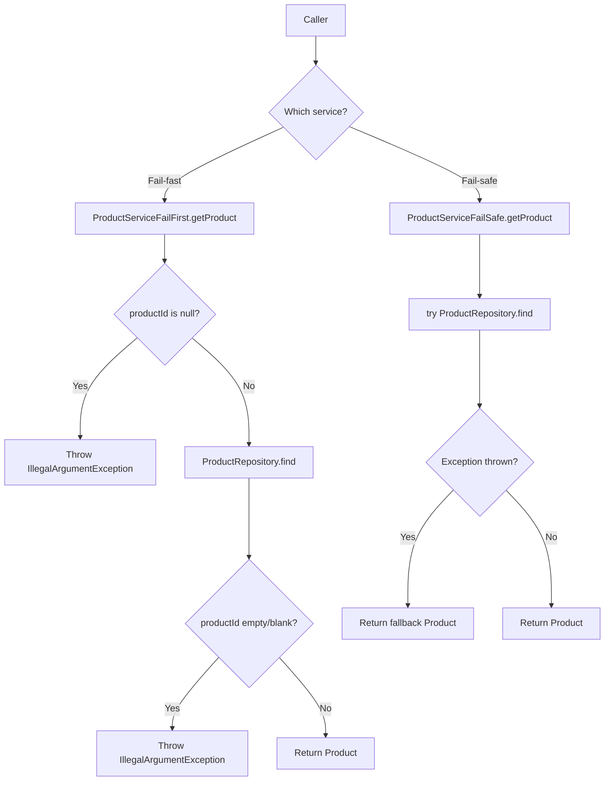
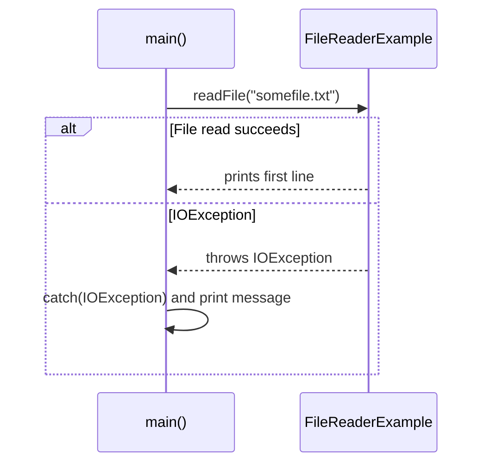

# Exceptions and Error Handling in Java

This repository contains small, focused Java examples that demonstrate common **exception-handling** patterns:

- **Fail-fast (fail-first)** validation
- **Fail-safe** fallback behavior
- Handling **checked exceptions** (e.g., `IOException`)
- Creating and throwing a **custom exception**

> Source code: `Main.java`

---

## What’s inside

### 1) Domain model: `Product`
A simple immutable value object with `id` and `name`.

### 2) Repository layer: `ProductRepository`
Validates input and throws an exception when the `productId` is invalid.

- Throws: `IllegalArgumentException` when `productId` is `null`, empty, or whitespace.

### 3) Service layer patterns

#### A) Fail-fast (Fail-first): `ProductServiceFailFirst`
Checks preconditions as early as possible and stops execution immediately for invalid input.

- Throws: `IllegalArgumentException` if `productId` is `null`
- Delegates to `ProductRepository.find(...)` for additional validation

#### B) Fail-safe: `ProductServiceFailSafe`
Attempts the operation and, if it fails, returns a safe default.

- Catches: `Exception`
- Returns: a fallback `Product("default", "Fallback Product")`

> Note: In production code, prefer catching **specific exception types** rather than `Exception`.

---

## Flow diagrams

### Product lookup (fail-fast vs fail-safe)



---

## Checked exception example: reading a file (`IOException`)

Class: `FileReaderExample`

- Method `readFile(String filePath)` declares `throws IOException`
- Caller handles it using `try/catch`



---

## Custom exception example

### `CustomerNotPlusException`
A custom **unchecked** exception (extends `RuntimeException`) thrown when a user is not a “Plus customer”.

### `CourseService.accessCourse(userId)`
- Checks access via `hasAccess(userId)`
- Throws `CustomerNotPlusException` if access is denied

```mermaid
flowchart TD
    A[CourseService.accessCourse(userId)] --> B{hasAccess(userId)?}
    B -->|No| C[Throw CustomerNotPlusException]
    B -->|Yes| D[Continue enrollment]
```

---

## How to run

This repo is a simple set of examples in a single Java file.

### Option 1: Compile & run (CLI)

```bash
javac Main.java
java FileReaderExample
```

> `FileReaderExample` includes a `main` method. Other classes demonstrate patterns but don’t have a runnable entry point.

### Option 2: IDE
Open the repository in IntelliJ IDEA / Eclipse, then run the `main` method inside `FileReaderExample`.

---

## Notes / best practices

- Prefer **fail-fast** validation for programmer errors (invalid arguments).
- Prefer **fail-safe** only when it is truly acceptable to continue with defaults.
- Catch the **most specific** exception type possible.
- Use **custom exceptions** to express domain-specific failure clearly.